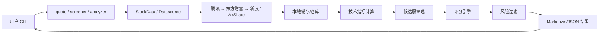
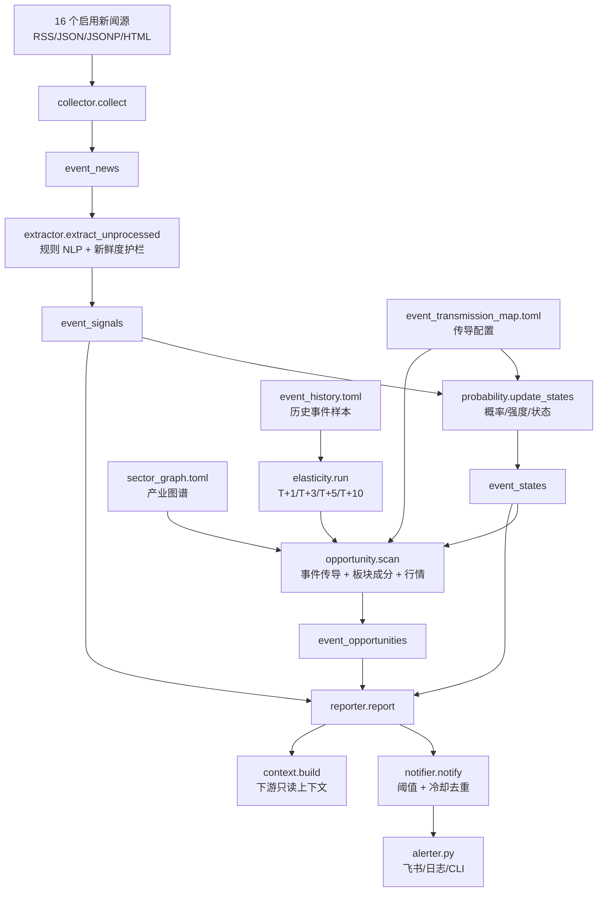
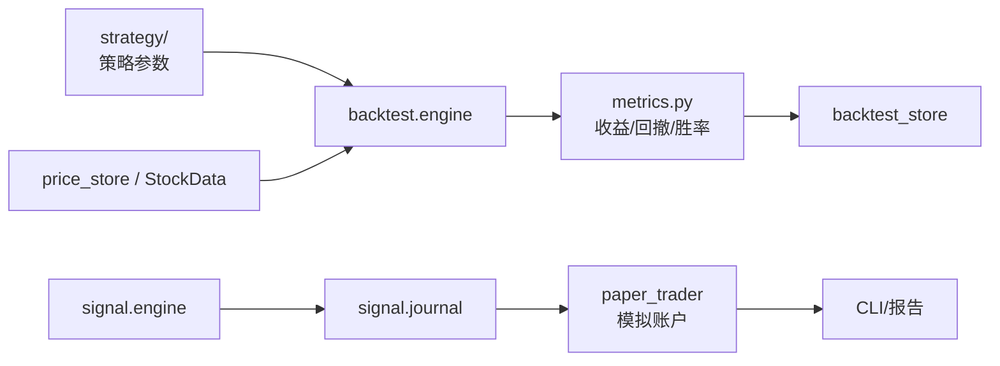
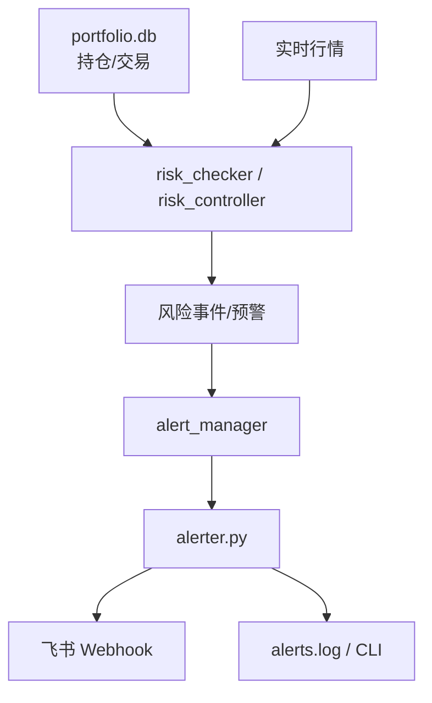
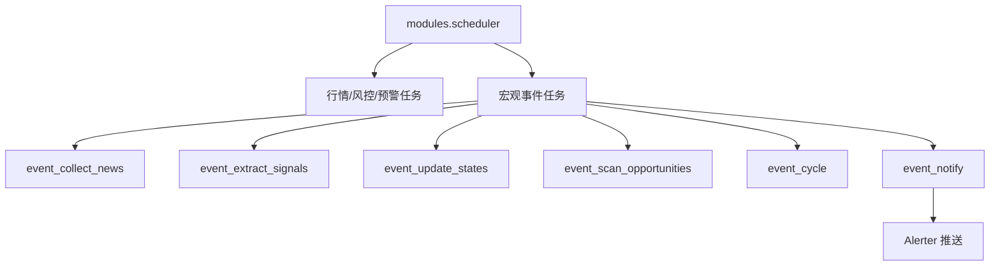

# MoatX 项目架构与流程图

> 来源模型：ChatGPT 5.5  
> 更新日期：2026-04-27  
> 用途：给开发者、后续大模型评审者和项目维护者快速理解 MoatX 的整体架构、数据流、核心模块和运行边界。

---

## 一、项目定位

MoatX 是一个面向 A 股的本地量化分析与情报辅助系统，核心目标不是自动下单，而是把行情、财务、技术指标、候选股、风控、回测、模拟交易、宏观事件情报统一到一个可解释的 CLI 工具链中。

当前系统主线：

```text
外部数据源
→ 数据采集与缓存
→ 本地数据库/仓库
→ 指标、评分、事件情报、风控、回测
→ CLI/报告/推送
→ 用户人工决策
```

---

## 二、总体架构图

```mermaid
flowchart TB
    User["用户 / 研究员"] --> CLI["CLI 入口\npython -m modules.cli"]
    Scheduler["scheduler 定时任务"] --> CLI

    subgraph DataSources["外部数据源"]
        AkShare["AkShare / 东方财富 / 同花顺"]
        Tencent["腾讯行情"]
        Sina["新浪行情"]
        News["RSS / JSON / JSONP / HTML 新闻源"]
        LocalFiles["Excel / TOML / 本地配置"]
    end

    subgraph Ingestion["采集与适配层"]
        StockData["stock_data.py\n行情/财务/公告"]
        Datasource["datasource.py\n个股行情多源校验聚合"]
        MarketIndex["market_index.py\n指数多源校验聚合"]
        Crawler["crawler/\nAPI 探测/缓存/板块/资金流"]
        EventCollector["event_intelligence.collector\n宏观新闻采集"]
    end

    subgraph Storage["本地存储层"]
        PortfolioDB["data/portfolio.db\n持仓/交易/预警/候选"]
        WarehouseDB["data/warehouse.db\n行情/回测/信号/事件"]
        Configs["data/*.toml\n配置/事件/产业图谱/源池"]
    end

    subgraph Engines["分析引擎层"]
        Indicators["indicators.py\n技术指标"]
        Screener["screener.py\n候选筛选"]
        Scoring["scoring_engine.py / rank_engine.py\n评分与排序"]
        Risk["risk_checker.py / risk_controller.py\n风险检查"]
        Backtest["backtest/\n回测引擎"]
        Signal["signal/\n信号与模拟交易"]
        EventIntel["event_intelligence/\n宏观事件情报"]
        SectorTags["sector_tags.py\n行业/概念标签"]
    end

    subgraph Output["输出与执行层"]
        Reports["Markdown / JSON 报告"]
        Alerts["alerter.py\n飞书/日志/CLI 推送"]
        Charts["charts.py\n图表"]
        Context["event context\n下游只读上下文"]
    end

    AkShare --> StockData
    Tencent --> Datasource
    Sina --> Datasource
    Tencent --> MarketIndex
    Sina --> MarketIndex
    News --> EventCollector
    LocalFiles --> Configs

    StockData --> WarehouseDB
    Datasource --> StockData
    MarketIndex --> Reports
    Crawler --> WarehouseDB
    EventCollector --> WarehouseDB

    PortfolioDB --> Screener
    WarehouseDB --> Indicators
    WarehouseDB --> Backtest
    WarehouseDB --> Signal
    WarehouseDB --> EventIntel
    Configs --> EventIntel
    Configs --> SectorTags

    Indicators --> Scoring
    Screener --> Scoring
    SectorTags --> EventIntel
    EventIntel --> Scoring
    Scoring --> Reports
    Risk --> Alerts
    EventIntel --> Alerts
    Backtest --> Reports
    Signal --> Reports
    Reports --> User
    Alerts --> User
    Charts --> User
    Context --> User
```



---

## 三、分层职责

| 层级 | 代表模块 | 职责 |
|---|---|---|
| CLI 层 | `modules/cli/`、`modules/__main__.py` | 统一命令入口，组织 quote/list/check/event/signal/paper 等子命令 |
| 配置层 | `modules/config.py`、`data/*.toml` | 管理运行配置、事件源、事件传导、产业图谱、模拟交易参数 |
| 数据源层 | `modules/stock_data.py`、`modules/datasource.py`、`modules/crawler/` | 拉取行情、财务、板块、资金流、网页/API 数据 |
| 存储层 | `modules/db/`、`data/portfolio.db`、`data/warehouse.db` | 统一迁移和存储行情、事件、信号、回测、任务日志 |
| 分析层 | `indicators.py`、`screener.py`、`scoring_engine.py`、`rank_engine.py` | 技术指标、候选股筛选、质量/估值/时机/风险评分 |
| 事件情报层 | `modules/event_intelligence/`、`sector_tags.py` | 新闻采集、事件抽取、概率更新、产业映射、机会生成、推送冷却 |
| 风控层 | `risk_checker.py`、`risk_controller.py`、`sell_signal.py` | 止损、仓位、回撤、卖出信号、风险告警 |
| 回测与模拟层 | `modules/backtest/`、`modules/signal/`、`modules/simulation.py` | 策略回测、信号日志、模拟账户和交易记录 |
| 输出层 | `alerter.py`、`charts.py`、report/context | Markdown/JSON 报告、图表、飞书/日志/CLI 推送 |
| 调度层 | `scheduler.py`、`data/schedule_config.toml` | 定时执行采集、检查、事件情报、推送等任务 |

---

## 四、核心业务流程

### 4.1 行情分析与选股流程



关键点：

- `datasource.py` 对个股实时行情做腾讯/东方财富/新浪多源查询、交叉校验、聚合输出；单源失败时自动降级为可用源。
- `market_index.py` 对大盘指数做腾讯/新浪多源交叉校验，避免指数代码和个股代码冲突。
- `stock_data.py` 封装行情、财务、公告等数据获取。
- `indicators.py` 负责 KDJ、RSI、BOLL、MACD 等技术指标。
- `scoring_engine.py` 聚合估值、盈利、技术、情绪、事件、风险等因子。
- 输出结果只作为研究参考，不自动交易。

### 4.2 宏观事件情报流程



当前事件情报模块完成度约 95%，已可持续运行。明确边界：

- 不自动下单。
- 不默认调用外部大模型。
- 当前 NLP 是规则系统，不是复杂语义推理。
- 输出是情报、机会、证据链、源质量、历史弹性，不是买卖指令。

### 4.3 回测与模拟交易流程



关键点：

- 回测与模拟交易用于验证策略想法。
- 模拟交易不是实盘交易。
- 事件情报可通过 context 输出给未来交易/回测适配器，但模块本身不下单。

### 4.4 风控与告警流程



关键点：

- 风控关注止损、仓位、回撤、风险分。
- 默认行为以通知为主。
- 自动卖出/自动交易类能力必须显式适配，不能默认启用。

---

## 五、主要功能模块清单

| 模块 | 入口/路径 | 当前作用 |
|---|---|---|
| CLI 总入口 | `python -m modules.cli` | 所有交互命令统一入口 |
| 实时行情 | `modules/cli/quote.py`、`stock_data.py`、`modules/datasource.py` | 查询个股或持仓实时行情，腾讯/东方财富/新浪多源校验聚合 |
| 大盘指数/宽度 | `modules/market_index.py`、`modules/cli/market.py` | 腾讯/新浪多源查询、校验、聚合 A 股主要指数；新浪快速统计上涨/下跌/平盘家数 |
| 持仓管理 | `portfolio.py`、`cli_portfolio.py`、`modules/cli/portfolio.py` | 持仓、交易、快照管理 |
| 候选股 | `candidate.py`、`screener.py` | 候选池维护和市场筛选 |
| 技术指标 | `indicators.py` | KDJ、RSI、BOLL、MACD 等 |
| 综合评分 | `scoring_engine.py`、`rank_engine.py` | 估值、盈利、时机、情绪、事件、风险综合打分 |
| 板块标签 | `sector_tags.py`、`data/sector_graph.toml` | 行业/概念标签、成分股、产业图谱 |
| 爬虫/API 探测 | `modules/crawler/`、`modules/cli/tool/probe.py` | 网站 API 探测、缓存、板块/资金流抓取 |
| 宏观事件情报 | `modules/event_intelligence/`、`modules/cli/tool/event.py` | 新闻源采集、事件抽取、机会扫描、报告、推送 |
| 风控 | `risk_checker.py`、`risk_controller.py` | 仓位、止损、回撤、风险告警 |
| 告警推送 | `alerter.py`、`alert_manager.py` | 飞书、日志、CLI 推送 |
| 回测 | `modules/backtest/` | 策略回测、手续费、指标、数据供给 |
| 策略库 | `modules/strategy/` | MA Cross、Mean Reversion、Breakout、Walk Forward 等 |
| 信号/模拟 | `modules/signal/`、`simulation.py` | 信号日志、模拟账户、模拟交易记录 |
| 调度 | `scheduler.py` | 定时执行事件采集、风险检查、推送等 |
| 数据库 | `modules/db/` | SQLite 迁移、行情、事件、回测、信号、任务日志 |

---

## 六、数据与配置资产

| 文件/数据库 | 作用 |
|---|---|
| `data/moatx.toml` | 主配置，含缓存、爬虫、风控、事件情报等参数 |
| `data/simulation.toml` | 模拟交易参数 |
| `data/feishu.toml` | 飞书推送配置，本地敏感配置 |
| `data/event_sources.toml` | 宏观事件新闻源池 |
| `data/event_transmission_map.toml` | 宏观事件到资产/板块/个股的传导规则 |
| `data/event_history.toml` | 历史事件样本，用于弹性回测 |
| `data/sector_graph.toml` | 产业/板块/概念图谱 |
| `data/event_sector_map.toml` | 事件驱动评分的板块映射兼容配置 |
| `data/portfolio.db` | 持仓、交易、候选股、预警等主业务库 |
| `data/warehouse.db` | 行情、回测、信号、事件情报、调度日志仓库 |
| `data/alerts.log` | 本地告警日志 |

---

## 七、数据库关系简图

```mermaid
erDiagram
    PORTFOLIO_DB ||--o{ HOLDINGS : stores
    PORTFOLIO_DB ||--o{ TRADES : stores
    PORTFOLIO_DB ||--o{ ALERTS : stores
    PORTFOLIO_DB ||--o{ CANDIDATES : stores

    WAREHOUSE_DB ||--o{ PRICE_DAILY : stores
    WAREHOUSE_DB ||--o{ BACKTEST_RUNS : stores
    WAREHOUSE_DB ||--o{ SIGNALS : stores
    WAREHOUSE_DB ||--o{ PAPER_TRADES : stores
    WAREHOUSE_DB ||--o{ EVENT_NEWS : stores
    WAREHOUSE_DB ||--o{ EVENT_SIGNALS : stores
    WAREHOUSE_DB ||--o{ EVENT_STATES : stores
    WAREHOUSE_DB ||--o{ EVENT_OPPORTUNITIES : stores
    WAREHOUSE_DB ||--o{ EVENT_NOTIFICATIONS : stores
    WAREHOUSE_DB ||--o{ EVENT_SOURCE_QUALITY : stores
    WAREHOUSE_DB ||--o{ EVENT_ELASTICITY : stores
```



说明：

- `portfolio.db` 更偏持仓与用户业务数据。
- `warehouse.db` 更偏行情仓库、事件仓库、回测和信号日志。
- 数据库 schema 由 `modules/db/migrations.py` 管理。

---

## 八、关键 CLI 命令

```powershell
# 总入口
python -m modules.cli --help

# 行情与持仓
python -m modules.cli quote 600519 000858
python -m modules.cli market
python -m modules.cli market --breadth
python -m modules.cli market 科创50 沪深300 --json
python -m modules.cli list
python -m modules.cli refresh

# 风控与预警
python -m modules.cli risk check
python -m modules.cli alerts --limit 50

# 诊断与 API 探测
python -m modules.cli diagnose
python -m modules.cli probe-api https://quote.eastmoney.com/sh600988.html

# 宏观事件情报
python -m modules.cli tool event sources --json
python -m modules.cli tool event collect --json
python -m modules.cli tool event extract --json
python -m modules.cli tool event run --json
python -m modules.cli tool event report
python -m modules.cli tool event notify --json
python -m modules.cli tool event context --json
python -m modules.cli tool event elasticity --windows 1,3,5,10 --json

# 调度
python -m modules.scheduler --list
```

---

## 九、调度任务总览



事件调度当前已启用。推送任务使用冷却去重，避免相同事件报告反复推送。

---

## 十、工程边界与安全约束

| 主题 | 当前边界 |
|---|---|
| 自动交易 | 不属于当前模块职责；默认不自动下单 |
| 外部大模型 | 不默认接入；可通过 `event context` 做未来适配 |
| 复杂 NLP | 当前是规则系统；可替换为后续分类器/LLM 适配器 |
| 新闻采集 | 只采集公开网页/RSS/API；单源失败不影响整体 |
| 旧新闻 | 默认跳过发布日期超过 14 天的新闻，防止误触发当前事件 |
| 推送 | CLI 默认 dry-run；显式 `--send` 或调度任务才发送 |
| 数据库写入 | 采集、抽取、状态、机会、回测、信号会写入 `warehouse.db` |
| 敏感配置 | 飞书配置在本地 `data/feishu.toml`，不应提交到公开仓库 |

---

## 十一、推荐阅读顺序

1. `README.md`：快速了解安装、CLI 和项目结构。
2. `docs/PROJECT_ARCHITECTURE.md`：理解整体架构和流程。
3. `docs/EVENT_INTELLIGENCE_IMPL_PLAN.md`：理解宏观事件情报模块落地状态。
4. `docs/EVENT_INTELLIGENCE_ALGORITHM.md`：理解事件驱动选股算法设计。
5. `docs/SCORING_ALGORITHM.md`：理解核心选股评分算法。
6. `docs/CRAWLER_USAGE.md`：理解 API 探测与爬虫工具。
7. `docs/BETA_PLAN.md`：理解后续生产化路线。

---

## 十二、后续演进建议

| 优先级 | 建议 | 说明 |
|---|---|---|
| P0 运维 | 每日查看源质量 | 重点观察 `source_recommendation`，淘汰低质源 |
| P0 数据 | 增加历史事件样本 | 提高事件弹性回测置信度 |
| P1 图谱 | 扩充产业图谱 | 增加上下游、替代品、受益/受损关系 |
| P1 算法 | 融合事件因子与评分因子 | 让事件机会进入更稳定的总评分体系 |
| P2 智能 | 接入复杂 NLP 或外部 LLM | 作为可选适配器，不改变默认规则系统 |
| P2 交易 | 独立自动交易适配层 | 必须独立开关、风控前置、人工确认 |
